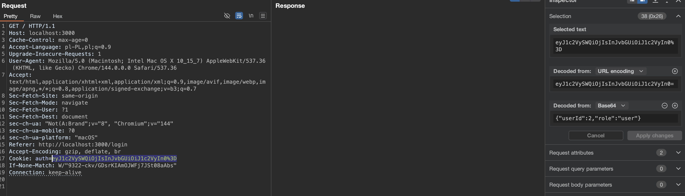
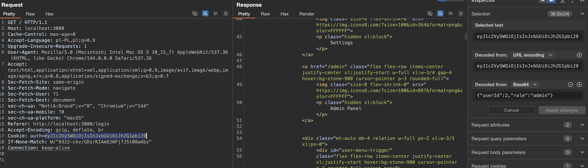
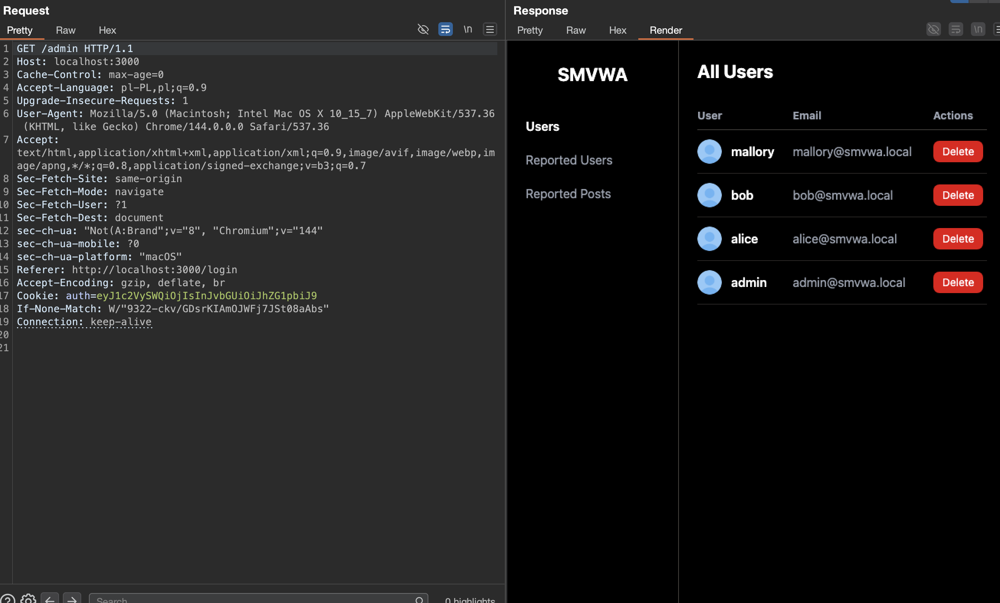

# Broken-Access-Control-01 — Forged Admin Role in Auth Cookie

## 1. Vulnerability Name
Broken Access Control / Client-Side Trust of Authorization Data — forged `role` value in `auth` cookie.

## 2. Brief Description
The application stores authentication state in a client-controlled `auth` cookie that contains only a Base64-encoded serialized object, without any signature or server-side integrity protection. The backend trusts the `role` field from that cookie and uses it in `requireAdmin` to authorize access to `/api/admin/*`. As a result, a standard user can modify the cookie payload from `{"role":"user"}` to `{"role":"admin"}` and immediately gain administrator access.

## 3. Environment & Assumptions
- Application: SMVWA (commit SHA: `7846ecb14448da0f2bc4822d25feda988dc92ad6`)
- Testing tools: Burp Suite Community Edition Version 2025.12.5 (20260123234417)
- Browser: Chromium Wersja 144.0.7559.97 (Oficjalna wersja) (arm64)
- User / test context: authenticated standard user, e.g. `alice@smvwa.local` / `Alice1234!`
- Relevant endpoints:
	- `POST /api/auth/login`
	- `/api/admin/*`

## 4. Steps to Reproduce (PoC)

### Vulnerable code
`vulnerable/backend/routes/auth.js`, around line 48:
```js
const payload = { userId: user.id, role: user.isadmin ? 'admin' : 'user' };
const token = Buffer.from(serialize.serialize(payload)).toString('base64');
res.cookie('auth', token);
```

`vulnerable/backend/middleware/auth.js`, around lines 4-6:
```js
function decodeToken(rawCookie) {
	const decoded = Buffer.from(rawCookie, 'base64').toString('utf-8');
	return serialize.unserialize(decoded);
}
```

`vulnerable/backend/middleware/auth.js`, around line 72:
```js
if (req.user.role !== 'admin' && req.user.role !== 'internal') {
	return res.status(403).json({ error: 'Forbidden: admins only' });
}
```

### Step 1 — Log in as a standard user
Authenticate as `alice@smvwa.local` / `Alice1234!` and capture the `auth` cookie value.

### Step 2 — Decode the cookie payload
Decode the Base64 cookie value. The decoded object contains authorization data similar to:
```text
{"userId":2,"role":"user"}
```

### Step 3 — Change `role` from `user` to `admin`
Modify the decoded payload to:
```text
{"userId":2,"role":"admin"}
```

Re-encode it as Base64 and replace the `auth` cookie in the browser or in Burp Repeater.

Example forged request:
```http
GET /api/admin/users HTTP/1.1
Host: localhost:3001
Cookie: auth=<base64-of-serialized-{"userId":2,"role":"admin"}>
```

### Step 4 — Access an admin-only endpoint
Send the request to `/api/admin` with the modified cookie.

Expected result:
- The server responds with `200 OK`.
- The endpoint returns data intended only for administrators.

### Step 5 — Compare with the original cookie
Repeat the same request using the original unmodified cookie.

Expected result:
- The server responds with `403 Forbidden`.
- This confirms that the authorization decision depends only on the client-controlled `role` value.

## 5. Evidence (Screenshots)




## 6. Impact (CIA + Business)
- **Confidentiality:** A low-privileged user can read administrator-only data, including user listings and reported content.
- **Integrity:** An attacker can perform privileged operations exposed through `/api/admin/*`, including deleting users, deleting posts, and moderating reported objects.
- **Availability:** Destructive admin actions can remove user accounts or content, affecting service availability and platform trust.
- **Business impact:** This is a full vertical privilege escalation caused by trusting client-side authorization data. Any authenticated user can become admin without exploiting the database or knowing any secret.

## 7. Risk Rating (CVSS 3.1)
```text
CVSS:3.1/AV:N/AC:L/PR:L/UI:N/S:U/C:H/I:H/A:L
Score: 8.8 — HIGH
```

Rationale: exploitation is straightforward for any authenticated user and directly results in administrator-level access.

## 8. Recommended Mitigation
Do not trust authorization attributes stored in client-controlled cookies. The server must either:

1. use signed and integrity-protected session tokens, or
2. store only an opaque session identifier in the cookie and keep role data server-side.

At minimum:
```js
// Do not authorize based directly on a user-controlled cookie payload.
// Instead, resolve the user and role server-side from a trusted session store.
```

## 9. Remediation Guidance
1. Replace the current Base64 serialized cookie with a signed session mechanism, such as an `httpOnly` session ID backed by a server-side session store.
2. Re-resolve the user's current role from the database or session store on each authenticated request instead of trusting a cookie field like `role`.
3. Add automated tests verifying that tampering with the cookie payload does not change authorization outcomes.
4. Invalidate all active sessions after deploying the fix.
