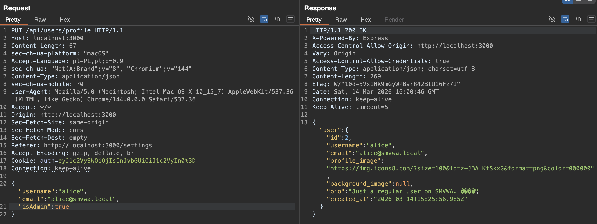
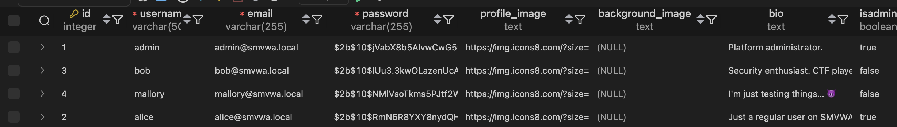

# Broken-Access-Control-02 — Privilege Escalation via Profile Update

## 1. Vulnerability Name
Broken Access Control / Mass Assignment — `PUT /api/users/profile`

## 2. Brief Description
The `PUT /api/users/profile` endpoint allows an authenticated low-privileged user to update the sensitive `isAdmin` field in their own database record. Because the application derives the session role from the `isadmin` column during login, a regular user can set `isAdmin=true`, log in again, and obtain full administrator privileges.

## 3. Environment & Assumptions
- Application: SMVWA (commit SHA: `7846ecb14448da0f2bc4822d25feda988dc92ad6`)
- Testing tools: Burp Suite Community Edition Version 2025.12.5 (20260123234417)
- User / test context: authenticated standard user, e.g. `alice@smvwa.local` / `Alice1234!`
- Relevant endpoints:
  - `PUT /api/users/profile`
  - `POST /api/auth/login`
  - `/api/admin/*`

## 4. Steps to Reproduce (PoC)

### Vulnerable code
`vulnerable/backend/routes/users/profile.js`, around line 33:
```js
const { username, email, bio, profile_image, background_image, password, isAdmin } = req.body;

if (isAdmin !== undefined) { updates.push(`isAdmin = ${isAdmin}`); }

const sql = `UPDATE users SET ${updates.join(', ')} WHERE id = ${req.user.userId} RETURNING id, username, email, profile_image, background_image, bio, created_at`;
```

`vulnerable/backend/routes/auth.js`, around line 48:
```js
const payload = { userId: user.id, role: user.isadmin ? 'admin' : 'user' };
```

### Step 1 — Log in as a normal user
Log in as `alice@smvwa.local` with password `Alice1234!` and intercept the request in Burp.

### Step 2 — Update the profile with `isAdmin=true`
Send the following request with Alice's valid session cookie:
```http
PUT /api/users/profile HTTP/1.1
Host: localhost:3001
Content-Type: application/json
Cookie: auth=<alice-session-cookie>

{
"username":"alice",
"email":"alice@smvwa.local",
"isAdmin":true
}
```

Expected result:
- The server responds with `200 OK`.
- The request is accepted even though `isAdmin` is a privileged field.

### Step 3 — Confirm the database change
Verify that Alice's `isadmin` value has changed to `true`:

### Step 4 — Log in again to obtain an admin token
Authenticate again as Alice. The application now issues a token with role `admin` because the login code reads the role from the updated `isadmin` column.

### Step 5 — Access an admin-only endpoint
Use the new session cookie to request an admin route such as:
```http
GET /api/admin/users HTTP/1.1
Host: localhost:3001
Cookie: auth=<new-alice-session-cookie>
```

Expected result:
- The request succeeds.
- Before the privilege escalation, the same request would return `403 Forbidden`.

## 5. Evidence (Screenshots)



## 6. Impact (CIA + Business)
- **Confidentiality:** A regular user can escalate to administrator and access sensitive administrative data, including user listings and reported content.
- **Integrity:** An attacker can perform admin-only actions such as deleting users, deleting posts, and clearing abuse reports.
- **Availability:** Admin-only delete operations can disrupt the platform by removing accounts or content.
- **Business impact:** This is a full vertical privilege escalation from standard user to administrator. It breaks the application's authorization model and can lead to complete administrative takeover.

## 7. Risk Rating (CVSS 3.1)
```text
CVSS:3.1/AV:N/AC:L/PR:L/UI:N/S:U/C:H/I:H/A:L
Score: 8.8 — HIGH
```

Rationale: the issue is remotely exploitable by any authenticated user and leads directly to administrator-level access across the application.

## 8. Recommended Mitigation
Do not allow client-controlled updates to authorization-sensitive fields such as `isAdmin`. Maintain an explicit allowlist of editable profile fields and reject or ignore any privilege-related attributes.

```js
// BEFORE (vulnerable):
const { username, email, bio, profile_image, background_image, password, isAdmin } = req.body;

// AFTER (safe):
const { username, email, bio, profile_image, background_image, password } = req.body;
```

## 9. Remediation Guidance
1. Remove `isAdmin` from the request model and SQL update builder in `backend/routes/users/profile.js`.
2. Replace dynamic SQL string concatenation with parameterized queries in the same handler.
3. Add automated tests that verify a non-admin user cannot change authorization attributes through profile endpoints.
4. Review all update endpoints for similar mass-assignment issues involving sensitive fields.
5. Reset any accounts that may already have been escalated in shared or test environments.
