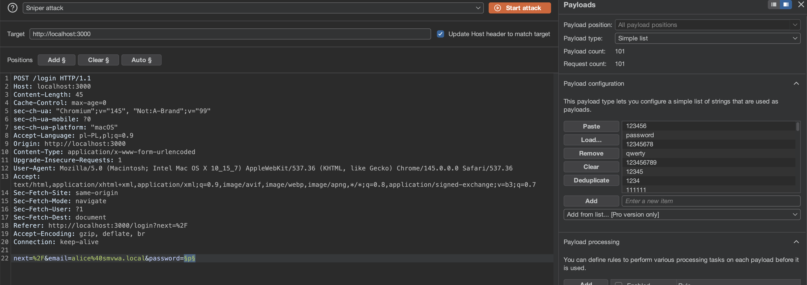
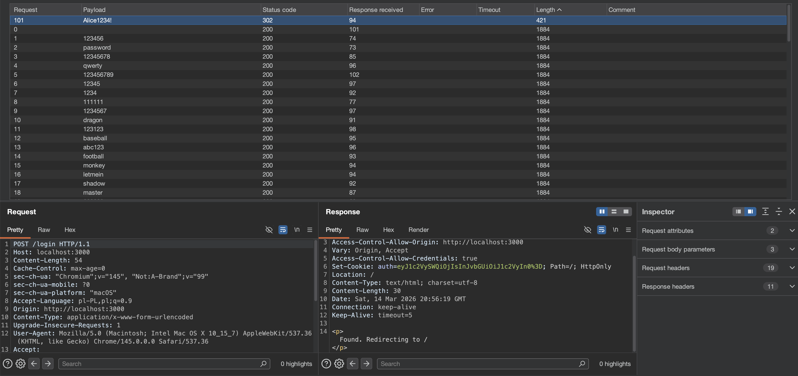

# Brute-Force-01 — No Rate Limiting on Login Endpoint

## 1. Vulnerability Name
Absence of Rate Limiting and Account Lockout on `POST /api/auth/login`

## 2. Brief Description
The `/api/auth/login` endpoint accepts arbitrary password attempts without any rate limiting, account lockout, or exponential backoff mechanism. An attacker can brute-force any known email address with a dictionary of common passwords and gain unauthorized access. No CAPTCHA or other challenge is presented, and no delays are introduced between attempts.

## 3. Environment & Assumptions
- Application: SMVWA (commit SHA: `7846ecb14448da0f2bc4822d25feda988dc92ad6`)
- Testing tool: Burp Suite Community Edition Version 2025.12.5 (20260123234417)
- User / test context: attacker targeting a known email account (e.g., `alice@smvwa.local`)
- Relevant endpoint: `POST /api/auth/login`

## 4. Steps to Reproduce (PoC)

### Vulnerable code
`vulnerable/backend/routes/auth.js`, around line 30:
```js
router.post('/login', async (req, res) => {
  const { email, password } = req.body;

  try {
    const sql = `SELECT id, isAdmin, email, password FROM users WHERE email = '${email}'`;
    const result = await pool.query(sql);

    if (result.rows.length === 0) {
      return res.status(HTTP_STATUS.UNAUTHORIZED).json({ error: 'Invalid email' });
    }

    const user = result.rows[0];
    const match = await bcrypt.compare(password, user.password);

    if (!match) {
      return res.status(HTTP_STATUS.UNAUTHORIZED).json({ error: 'Invalid password' });
    }
    // ... returns token on success
  } catch (error) {
    return handleError(res, error, 'Login error');
  }
});
```

No rate limiting middleware is applied.

### Step 1 — Identify target email
The attacker knows or guesses a valid email address (e.g., `alice@smvwa.local`).

### Step 2 — Prepare a password dictionary
Create or obtain a list of common passwords (e.g., `password`, `123456`, `admin123`, `Alice1234`, etc.).

### Step 3 — Brute-force login with Burp Intruder or similar tool
Send repeated login requests:
```http
POST /api/auth/login HTTP/1.1
Host: localhost:3001
Content-Type: application/json

{"email":"alice@smvwa.local","password":"§password§"}
```

Use Intruder's Sniper mode to iterate through the password list.

Expected result:
- All requests succeed immediately without delay.
- No account lockout occurs.
- No CAPTCHA is presented.
- Typically, one of the top 1000 common passwords will match.

### Step 4 — Identify the correct password
Monitor the responses:
- Successful response: Found. Redirecting to /
- Failed response: `{"error":"Invalid password"}`

Expected result:
- One response differs from the others.
- That response contains a valid auth token.

### Step 5 — Log in with the recovered credentials
```bash
curl -s -X POST http://localhost:3001/api/auth/login \
  -H "Content-Type: application/json" \
  -d '{"email":"alice@smvwa.local","password":"Alice1234!"}'
```

Expected result:
- Authentication succeeds.
- Session cookie / token is issued.
- Attacker gains full account access.

## 5. Evidence (Screenshots)



## 6. Impact (CIA + Business)
- **Confidentiality:** An attacker can brute-force and take over any user account with a common password, accessing private data, messages, and personal information.
- **Integrity:** The attacker can modify the compromised account, post content, send messages, and impersonate the user.
- **Availability:** Attacker can delete posts, spam, or disrupt the account and other users' experience.
- **Business impact:** Large-scale account takeovers are possible, undermining user trust and regulatory compliance (GDPR, HIPAA depending on use case). No rate limiting means attacks can be conducted in bulk across many accounts simultaneously.

## 7. Risk Rating (CVSS 3.1)
```text
CVSS:3.1/AV:N/AC:L/PR:N/UI:N/S:U/C:H/I:H/A:L
Score: 8.6 — HIGH
```

Rationale: remotely exploitable at network level, low complexity, no privileges or user interaction required, results in unauthorized access.

## 8. Recommended Mitigation
1. Enforce rate limiting on `/api/auth/login`:
   - Max 5 failed login attempts per IP address per 15 minutes
   - Max 10 failed login attempts per email address per 1 hour
   - Return `429 Too Many Requests` when threshold exceeded

2. Implement progressive account lockout:
   - Temporary lockout (15 minutes) after 5 failed attempts on the same account
   - Escalate to 1-hour lockout after 10 failures within 24 hours

3. Add CAPTCHA after 3 failed attempts on the same email or IP.

4. Implement exponential backoff:
   - Add 1-second delay after 1st failed attempt
   - Double delay on each subsequent attempt (2s, 4s, 8s, etc., capped at 60s)

5. Log all failed login attempts and alert on suspicious patterns.

6. Do not disclose whether an email exists; use generic error: "Invalid email or password".

## 9. Remediation Guidance
1. Install and configure a rate-limiting middleware (e.g., `express-rate-limit`):
   ```js
   const rateLimit = require('express-rate-limit');
   
   const loginLimiter = rateLimit({
     windowMs: 15 * 60 * 1000, // 15 minutes
     max: 5, // 5 requests per windowMs per IP
     message: 'Too many login attempts, please try again later',
     standardHeaders: true,
     legacyHeaders: false,
   });
   
   router.post('/login', loginLimiter, async (req, res) => { ... });
   ```

2. Add a `login_attempts` table to track failed attempts:
   ```sql
   CREATE TABLE login_attempts (
     id SERIAL PRIMARY KEY,
     email VARCHAR(255) NOT NULL,
     ip_address VARCHAR(45),
     attempt_at TIMESTAMP DEFAULT NOW(),
     success BOOLEAN DEFAULT FALSE
   );
   ```

3. Check the table on each failed attempt and enforce lockout:
   ```js
   const failedAttempts = await pool.query(
     `SELECT COUNT(*) as count FROM login_attempts WHERE email = $1 AND attempt_at > NOW() - INTERVAL '1 hour' AND success = FALSE`,
     [email]
   );
   
   if (failedAttempts.rows[0].count >= 5) {
     return res.status(429).json({ error: 'Too many login attempts. Please try again later.' });
   }
   ```

4. Implement exponential backoff by storing the last failed attempt timestamp and calculating delay.

5. Add comprehensive logging and alerting for repeated failed attempts on the same email or IP.

6. Add automated tests verifying that:
   - 5 failed attempts on the same email trigger a 429 response,
   - rate limit resets after the window expires,
   - successful login does not trigger lockout.
