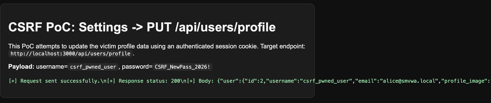
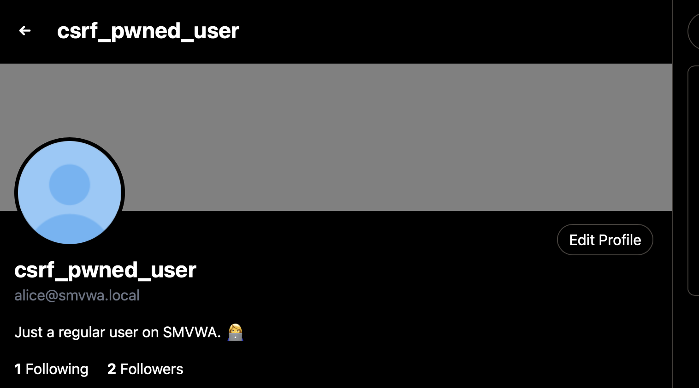

# CSRF-01 - Cross-Site Request Forgery in Settings Profile Update

## 1. Vulnerability Name
Cross-Site Request Forgery (CSRF) - profile update via Settings (`PUT /api/users/profile`)

## 2. Brief Description
The `Settings` section sends account updates (including `username` and `password`) to `PUT /api/users/profile`. The application does not implement CSRF tokens or `Origin`/`Referer` validation, so a state-changing request can be forced in the context of a logged-in victim.

As a result, an attacker can change victim profile data without consent if the victim visits a crafted PoC page while their session is active.

## 3. Environment & Assumptions
- Application: SMVWA (commit SHA: `7846ecb14448da0f2bc4822d25feda988dc92ad6`)
- Testing tools: Safari 26.2, local HTTP server
- User / test context: {"email":"alice@smvwa.local","password":"Alice1234!"} or any with role user
- Affected endpoint: `PUT http://localhost:3000/api/users/profile` (proxy to backend `PUT /api/users/profile`)

## 4. Steps to Reproduce (PoC)

### Vulnerable code
`vulnerable/frontend/views/pages/settings.ejs`:
```js
const response = await fetch(`${API_URL}/api/users/profile`, {
  method: 'PUT',
  credentials: 'include',
  headers: { 'Content-Type': 'application/json' },
  body: JSON.stringify(body)
});
```

`vulnerable/backend/routes/users/profile.js`:
```js
router.put('/profile', authMiddleware, async (req, res) => {
  const { username, email, bio, profile_image, background_image, password, isAdmin } = req.body;
  // update is executed without a CSRF protection mechanism
});
```

### Manual verification
1. Log in as the victim user and keep the session active.
2. Open the artifact: `pentest/DAST/reports/CSRF-01-password-change/artifacts/csrf-settings-change.html`.
3. The page automatically sends `PUT /api/users/profile` with a new `username` and `password`.
4. Open `/settings` and confirm the username change and successful login with the new password.

### HTTP request used by PoC
```http
PUT /api/users/profile HTTP/1.1
Host: localhost:3000
Content-Type: application/json
Cookie: auth=<victim-session>

{"username":"csrf_pwned_user","password":"CSRF_NewPass_2026!"}
```

## 5. Evidence (Artifacts)
- PoC page: `artifacts/csrf-settings-change.html`



## 6. Impact (CIA + Business)
- **Confidentiality:** Password change can lead to account takeover and access to private data.
- **Integrity:** The attacker modifies profile data (e.g., `username`) without user consent.
- **Availability:** The victim may lose access to the account after a forced password change.
- **Business impact:** High risk of account takeover and loss of user trust.

## 7. Risk Rating (CVSS 3.1)
```text
CVSS:3.1/AV:N/AC:L/PR:N/UI:R/S:U/C:H/I:H/A:H
Score: 8.8 - HIGH
```

## 8. Recommended Mitigation
1. Implement CSRF tokens (synchronizer token pattern or double-submit cookie) for all state-changing requests.
2. Enforce `Origin` and/or `Referer` validation for `PUT/POST/PATCH/DELETE`.
3. For critical changes (password/email), require current password re-authentication or step-up auth.
4. Restrict privileged field updates (e.g., `isAdmin`) with a strict backend allowlist.

## 9. Remediation Guidance
1. Add CSRF middleware on both frontend/proxy and backend API layers.
2. Reject requests without a valid CSRF token and from untrusted origins.
3. Split generic profile edit and password change into separate endpoints, and add extra verification for password changes.
4. Add integration tests verifying that cross-site PoC requests without token are rejected with `403`.
