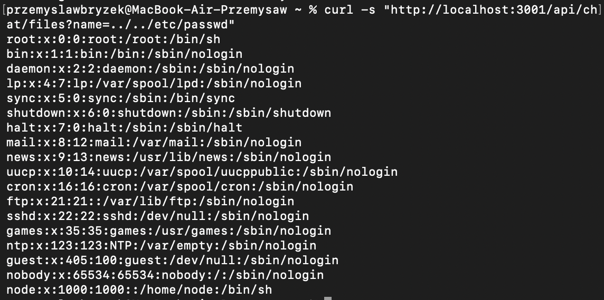
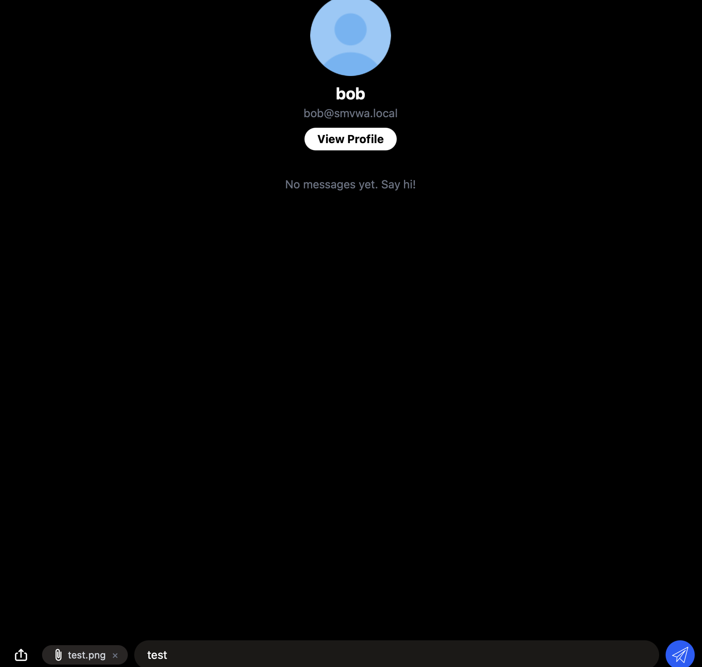
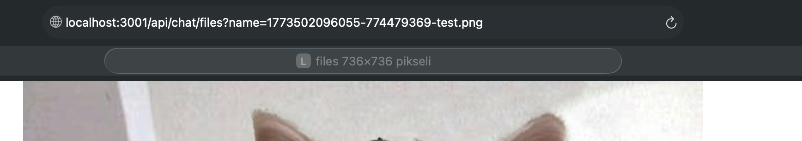
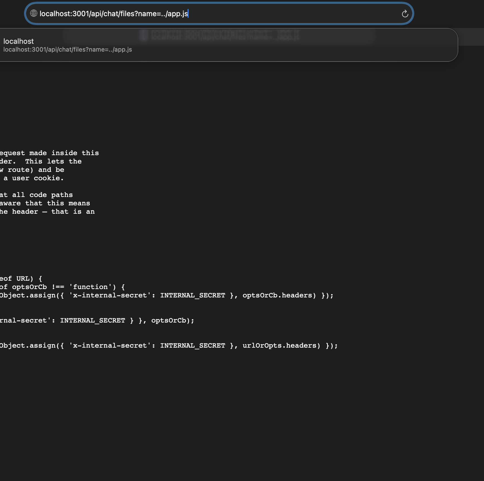

# Path-Traversal-01 — Path Traversal in Chat File Download Endpoint

## 1. Vulnerability Name
Path Traversal (Directory Traversal / Arbitrary File Read) — `GET /api/chat/files`

## 2. Brief Description
The `name` query parameter of the unauthenticated `GET /api/chat/files` endpoint is passed directly to `path.join()` and then to `res.sendFile()` without any sanitisation. An attacker can supply `../` sequences to escape the intended `chat_files/` directory and read any file that the Node.js process has permission to access — including `/etc/passwd`, application source code, database schema, and environment secrets.

## 3. Environment & Assumptions
- Application: SMVWA (commit SHA: `7846ecb14448da0f2bc4822d25feda988dc92ad6`)
- Testing tools: Safari 26.2, curl
- User / test context: **no authentication required** (public endpoint)
- Backend base URL: `http://localhost:3001` (direct API) or via frontend proxy at `http://localhost:3000`
- Container working directory: `/app`; chat files stored at `/app/chat_files`

## 4. Steps to Reproduce (PoC)

### Vulnerable code
`vulnerable/backend/routes/chat.js`, lines 41–48:
```js
router.get('/files', (req, res) => {
  const filename = req.query.name;          //user-controlled, no validation
  if (!filename) {
    return res.status(HTTP_STATUS.BAD_REQUEST).json({ error: 'filename is required' });
  }
  const filePath = path.join(chatFilesPath, filename);  //traversal not blocked
  res.sendFile(filePath, err => {
    if (err) { res.status(404).json({ error: 'File not found' }); }
  });
});
```
`path.join('/app/chat_files', '../../etc/passwd')` resolves to `/etc/passwd`.

### Via curl — Read `/etc/passwd` (no authentication)
```bash
curl -s "http://localhost:3001/api/chat/files?name=../../etc/passwd"
```

### Via browser (Safari / any browser)
- Go to chat and send file
- Click on file bubble
- Change path in urn
```
http://localhost:3001/api/chat/files?name=../app.js
```

## 5. Evidence (Screenshots)





## 6. Impact (CIA + Business)
- **Confidentiality:** An unauthenticated attacker can read any file accessible to the `node` process — OS user files (`/etc/passwd`), application source code, database credentials, and the `INTERNAL_SECRET` value that grants trusted-caller privileges to all internal API endpoints.
- **Integrity:** The endpoint is read-only; no direct write impact. However, leaking `INTERNAL_SECRET` enables chained attacks that could modify application state.
- **Availability:** No direct denial-of-service from this endpoint alone.
- **Business impact:** Full disclosure of server-side secrets and configuration. Leaking `INTERNAL_SECRET` enables privilege escalation to bypass authentication middleware on all `/api/*` endpoints, leading to complete application compromise.

## 7. Risk Rating (CVSS 3.1)
```
CVSS:3.1/AV:N/AC:L/PR:N/UI:N/S:U/C:H/I:N/A:N
Score: 7.5 — HIGH
```
Rationale: network-exploitable with no credentials and no user interaction; high confidentiality impact due to unrestricted file read.

## 8. Recommended Mitigation
Validate that the resolved path stays within the intended directory before serving the file:

```js
// AFTER (safe):
router.get('/files', (req, res) => {
  const filename = path.basename(req.query.name || ''); // strip any directory components
  if (!filename) {
    return res.status(400).json({ error: 'filename is required' });
  }
  const filePath = path.join(chatFilesPath, filename);
  // Belt-and-suspenders: verify the resolved path is still inside chatFilesPath
  if (!filePath.startsWith(chatFilesPath + path.sep)) {
    return res.status(400).json({ error: 'Invalid filename' });
  }
  res.sendFile(filePath, err => {
    if (err) { res.status(404).json({ error: 'File not found' }); }
  });
});
```

## 9. Remediation Guidance
1. **Immediate:** replace `path.join(chatFilesPath, filename)` with `path.join(chatFilesPath, path.basename(filename))` and add the `startsWith` guard shown above.
2. Add authentication (`authMiddleware`) to the `/api/chat/files` endpoint — chat attachments should only be accessible to logged-in users.
3. Rename uploaded files to random UUIDs (removing the original name entirely) so even a legitimate filename cannot be guessed or abused.
4. Add a semgrep / ESLint-security rule (`security/detect-non-literal-fs-filename`) to catch unsanitised `path.join` + `sendFile` patterns in CI.
5. In the container, run the Node process as a non-root user with the minimal filesystem permissions needed (already done — `node` user), and mount `chat_files` as its own Docker volume isolated from the rest of `/app`.
