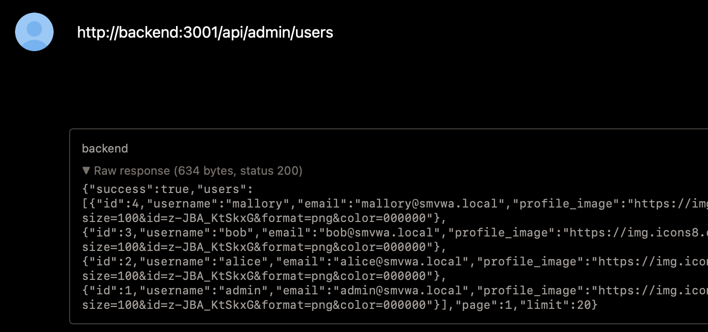

# SSRF-01 - Server-Side Request Forgery in Post Preview Endpoint

## 1. Vulnerability Name
Server-Side Request Forgery (SSRF) - `POST /api/posts/preview`

## 2. Brief Description
The preview feature fetches arbitrary URLs provided by the user using `http.get`/`https.get` with no allowlist, no private-IP blocking, and no protocol restrictions beyond `http/https`. Because outgoing requests are globally patched to include `x-internal-secret`, the backend can access internal protected endpoints and return their raw response in preview output.

## 3. Environment & Assumptions
- Application: SMVWA (commit SHA: `7846ecb14448da0f2bc4822d25feda988dc92ad6`)
- Testing tools: Safari 26.2
- User / test context: authenticated user creating a post
- Endpoint: `POST http://localhost:3000/api/posts/preview`

## 4. Steps to Reproduce (PoC)

### Vulnerable code
`vulnerable/backend/routes/posts/preview.js`:
```js
const client = url.startsWith('https') ? https : http;
const request = client.get(url, { timeout: 5000 }, (response) => {
	// ...
	return res.json({
		url,
		title,
		description,
		headers: response.headers,
		rawBody: data.substring(0, 2000),
	});
});
```

`vulnerable/backend/app.js` (global internal-secret injection):
```js
optsOrCb = Object.assign({}, optsOrCb, {
	headers: Object.assign({ 'x-internal-secret': INTERNAL_SECRET }, optsOrCb.headers)
});
```

### Manual verification
Submit preview URL pointing to an internal API resource:
```text
http://backend:3001/api/admin/users
```

Observed behavior: preview response contains internal endpoint body (user list), proving server-side access to internal-only resources.

## 5. Evidence (Artifacts)


Visible output includes raw JSON from:
`http://backend:3001/api/admin/users`

## 6. Impact (CIA + Business)
- **Confidentiality:** Internal/admin API responses can be exfiltrated.
- **Integrity:** If internal write endpoints are reachable, attacker may trigger privileged actions.
- **Availability:** SSRF can be abused for internal port scanning and service pressure.
- **Business impact:** Internal trust boundary collapse; potential full compromise of admin-only surfaces.

## 7. Risk Rating (CVSS 3.1)
```text
CVSS:3.1/AV:N/AC:L/PR:L/UI:N/S:C/C:H/I:H/A:L
Score: 9.4 - CRITICAL
```

## 8. Recommended Mitigation
1. Implement strict URL allowlist for preview targets (trusted domains only).
2. Block requests to private/reserved address ranges (`127.0.0.0/8`, RFC1918, link-local, metadata IPs).
3. Disable automatic forwarding of internal auth headers for untrusted outbound requests.
4. Return only sanitized metadata fields; never include `rawBody` or full response headers.

## 9. Remediation Guidance
1. Parse URL using `new URL()` and enforce protocol/domain constraints before request.
2. Resolve DNS and re-check IP after resolution to prevent DNS rebinding.
3. Move preview fetch to isolated service with egress firewall policy.
4. Add security tests for SSRF payloads targeting loopback and internal hostnames.
