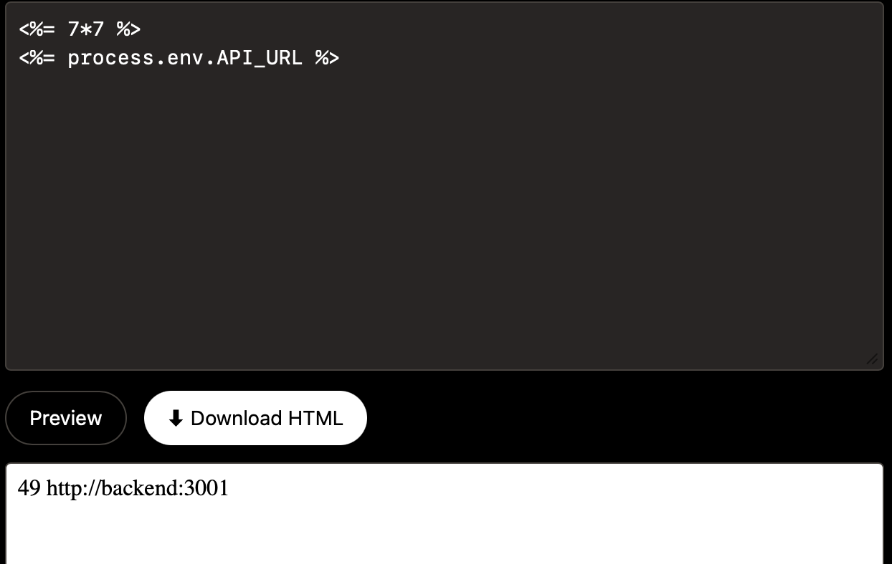

# SSTI-01 - Server-Side Template Injection in Business Card Export

## 1. Vulnerability Name
Server-Side Template Injection (SSTI) - `POST /api/profile/export`

## 2. Brief Description
The endpoint renders a caller-controlled EJS template string directly using `ejs.render(template, ...)`. This allows arbitrary EJS expression execution on the server. Depending on runtime hardening, this can lead to sensitive data exposure and potentially remote code execution.

## 3. Environment & Assumptions
- Application: SMVWA (commit SHA: `7846ecb14448da0f2bc4822d25feda988dc92ad6`)
- Testing tools: browser devtools / curl
- User / test context: endpoint reachable from frontend API proxy
- Endpoint: `POST http://localhost:3000/api/profile/export`

## 4. Steps to Reproduce (PoC)

### Vulnerable code
`vulnerable/frontend/routes/api.js`:
```js
router.post('/api/profile/export', async (req, res) => {
	const template = req.body.template || DEFAULT_CARD_TEMPLATE;
	const html = ejs.render(template, { user, parseContent });
	return res.send(html);
});
```

### Manual verification
```bash
curl -s -X POST http://localhost:3000/api/profile/export \
	-H "Content-Type: application/json" \
	-d '{"template":"<h1><%= 1 %></h1>"}'
```

Expected result: server returns rendered HTML containing `1`, confirming server-side execution of attacker-controlled template code.

## 5. Evidence (Artifacts)


## 6. Impact (CIA + Business)
- **Confidentiality:** Template can access server-side data exposed to template context and potentially process data.
- **Integrity:** Malicious templates can alter output files and abuse server resources.
- **Availability:** Expensive template expressions can cause CPU/memory exhaustion.
- **Business impact:** High-impact server compromise risk on a public-facing endpoint.

## 7. Risk Rating (CVSS 3.1)
```text
CVSS:3.1/AV:N/AC:L/PR:N/UI:N/S:C/C:H/I:H/A:H
Score: 10.0 - CRITICAL
```

## 8. Recommended Mitigation
1. Do not render user-provided templates.
2. Restrict export to predefined server-side templates (ID-based selection).
3. If customization is required, implement a safe declarative template format (no code execution).
4. Add strict output encoding and content security controls.

## 9. Remediation Guidance
1. Replace `ejs.render(template, ...)` with a fixed template file rendered via safe data bindings only.
2. Reject any request containing template control tokens (`<%`, `%>`).
3. Add security tests asserting that payloads like `<%= 1 %>` are returned as plain text, not executed.
4. Monitor endpoint for suspicious template-like payload patterns.
