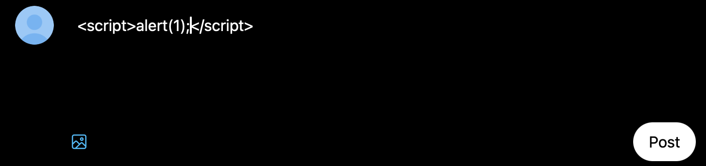
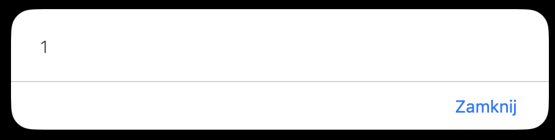
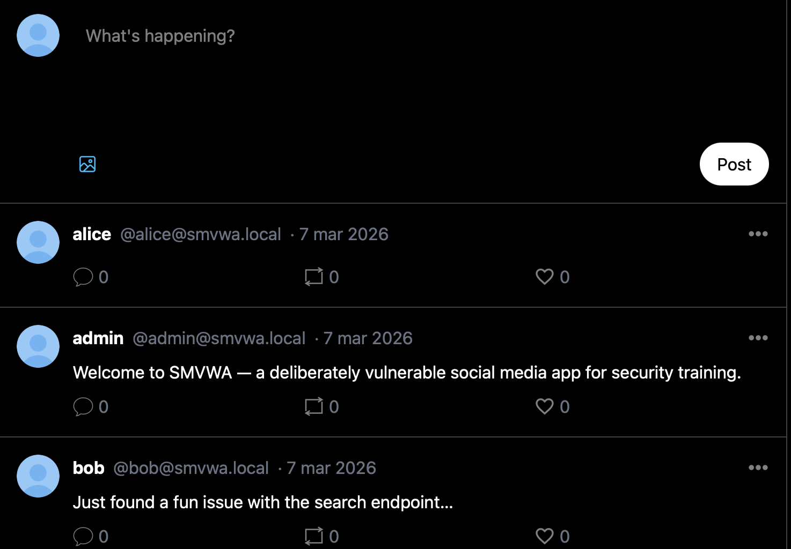

# XSS-01 - Stored Cross-Site Scripting in Post Content

## 1. Vulnerability Name
Stored Cross-Site Scripting (XSS) - post body rendering (`post.content`)

## 2. Brief Description
User-supplied post content is rendered unescaped in EJS templates via `<%- ... %>`. The helper `parseContent` does not sanitize HTML and preserves injected tags, enabling persistent script execution for any user viewing the post/feed.

## 3. Environment & Assumptions
- Application: SMVWA (commit SHA: `7846ecb14448da0f2bc4822d25feda988dc92ad6`)
- Testing tools: Safari 26.2
- User / test context: {"email":"alice@smvwa.local","password":"Alice1234!"} or any with role user

## 4. Steps to Reproduce (PoC)

### Vulnerable code
`vulnerable/frontend/components/postTemplate.ejs`:
```ejs
<p class="mt-2 z-20"><%- parseContent(post.content) %></p>
```

`vulnerable/frontend/utils/contentParser.js`:
```js
function parseContent(text) {
	// converts links/hashtags/mentions but does not sanitize HTML
	return text;
}
```

### Manual verification
1. Log in as normal user.
2. Create a post containing payload, e.g.:
```html
<script>alert(1)</script>
```
3. Open home feed or post page as another user.
4. JavaScript executes in victim browser context.

## 5. Evidence (Artifacts)




## 6. Impact (CIA + Business)
- **Confidentiality:** Session data and sensitive page content can be exfiltrated from victims.
- **Integrity:** Attacker can perform actions as victim (CSRF via JS, content tampering).
- **Availability:** Malicious scripts can break UI and degrade client-side availability.
- **Business impact:** Stored XSS can spread to many users and lead to account takeover.

## 7. Risk Rating (CVSS 3.1)
```text
CVSS:3.1/AV:N/AC:L/PR:L/UI:R/S:C/C:H/I:H/A:L
Score: 8.7 - HIGH
```

## 8. Recommended Mitigation
1. Treat all user-generated content as untrusted HTML.
2. Replace `<%- ... %>` with escaped output `<%= ... %>` wherever raw HTML is not strictly required.
3. If rich text is needed, sanitize with a robust allowlist sanitizer (server-side and client-side).
4. Enforce strict CSP (`script-src 'self'` without inline execution).

## 9. Remediation Guidance
1. Update `parseContent` to first HTML-escape input, then safely apply link/mention formatting.
2. Audit all EJS templates for unsafe `<%-` usage with user-controlled data.
3. Add regression tests that post `<script>alert(1)</script>` and assert escaped output.
4. Add output encoding checks to secure code review checklist.
