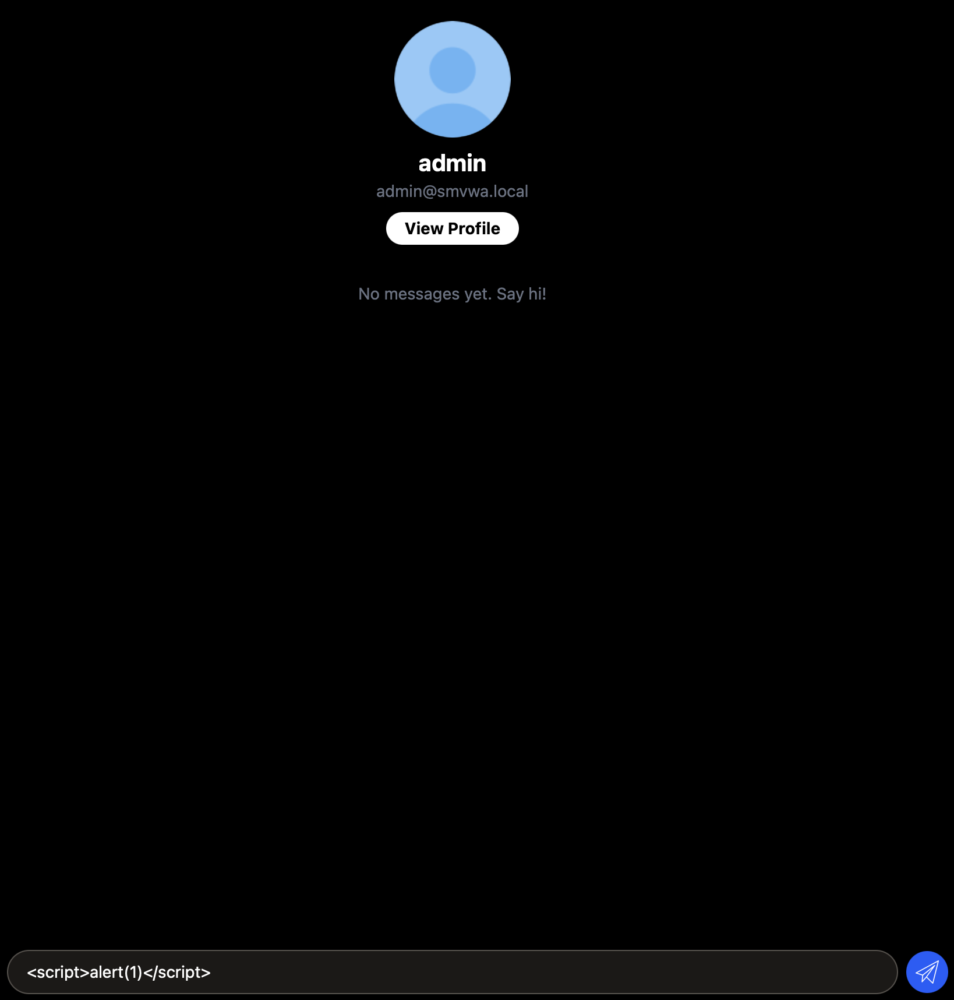
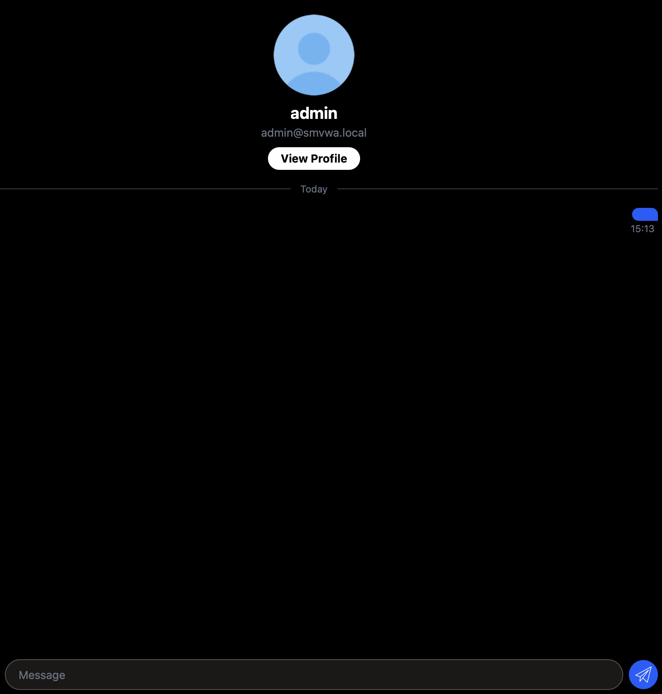
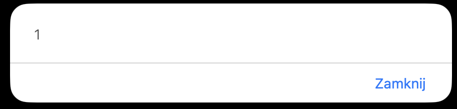

# XSS-02 - Stored Cross-Site Scripting in Chat Messages

## 1. Vulnerability Name
Stored Cross-Site Scripting (XSS) - chat message content (`message.content`)

## 2. Brief Description
Chat messages are rendered using unescaped EJS output (`<%- message.content %>`), allowing attacker-controlled HTML/JavaScript to execute when a recipient opens the conversation. The same risk applies to dynamically rendered message bubbles in client-side JS.

Additionally, the chat transport uses WebSocket (`ws://...:3001`) and forwards `content` to recipients in near real-time. The backend does not sanitize `content` before saving/broadcasting, and the frontend inserts WebSocket-delivered content into the DOM via `innerHTML` in `createBubble(...)`, which makes the WebSocket path an active exploit delivery channel, not only a stored render issue on page reload.

## 3. Environment & Assumptions
- Application: SMVWA (commit SHA: `7846ecb14448da0f2bc4822d25feda988dc92ad6`)
- Testing tools: Safari 26.2
- User / test context: authenticated user sends message to another user
- Affected route/view: `/chat/:partnerId`, `views/chat.ejs`

## 4. Steps to Reproduce (PoC)

### Vulnerable code
`vulnerable/frontend/views/chat.ejs`:
```ejs
<div class="...">
	<%- message.content %>
</div>
```

### Manual verification
1. Open a chat conversation.
2. Send payload as a message:
```html
<script>alert(1)</script>
```
3. Open the same conversation as recipient.
4. Payload executes in recipient browser context.

### WebSocket attack path (technical)
1. Sender client opens WebSocket to backend (`WS_URL = ws://<host>:3001`) and sends:
```json
{ "type": "message", "to": <partnerId>, "content": "<script>alert(1)</script>" }
```
2. Backend (`backend/websocket.js`) stores `content` directly in DB and forwards it to recipient as `type: "message"` without output encoding/sanitization.
3. Recipient client (`views/chat.ejs`, JS section) handles `data.type === 'message'` and calls:
```js
msgContainer.appendChild(createBubble(data.content, false, false, data.created_at, data.attachment || null));
```
4. `createBubble(...)` builds markup with template literal and assigns it through `wrapper.innerHTML`, so attacker-controlled `content` becomes executable DOM.

## 5. Evidence (Artifacts)




## 6. Impact (CIA + Business)
- **Confidentiality:** Message viewers can have cookies/session context abused.
- **Integrity:** Attacker can execute arbitrary actions via victim's authenticated session.
- **Availability:** Script payloads can disrupt chat interface.
- **Business impact:** Trust and safety issue in private messaging; account takeover vector.

WebSocket context increases practical risk because delivery is immediate (live recipient session), requires no refresh, and can impact multiple active chat participants quickly.

## 7. Risk Rating (CVSS 3.1)
```text
CVSS:3.1/AV:N/AC:L/PR:L/UI:R/S:C/C:H/I:H/A:L
Score: 8.7 - HIGH
```

## 8. Recommended Mitigation
1. Escape message content before rendering (`<%= message.content %>` in EJS).
2. For rich text, sanitize with strict allowlist and strip scripts/events/JS URLs.
3. Apply CSP that blocks inline script execution.
4. Validate and sanitize at both ingest and render stages.
5. Treat WebSocket payloads as untrusted input at receive/render boundaries; never pass `data.content` into `innerHTML` without sanitization/encoding.

## 9. Remediation Guidance
1. Replace unsafe render path in `views/chat.ejs` and in any JS template literals.
2. Add unit/integration tests for chat messages containing `<script>` and event handlers.
3. Perform a full template audit for `<%-` with user-controlled variables.
4. Backfill cleanup/migration for already stored malicious messages.
5. Add WebSocket-focused regression tests (incoming `type: message` with HTML/JS payload) to confirm safe rendering in real-time flow.
