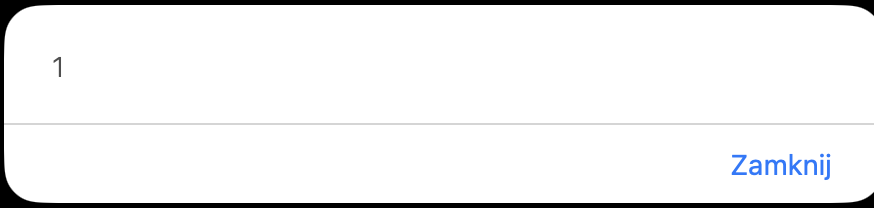
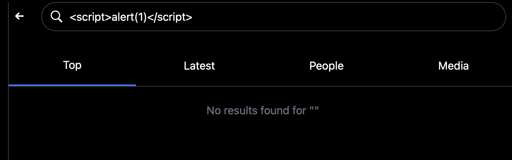

# XSS-03 - Reflected Cross-Site Scripting in Explore/Search Page

## 1. Vulnerability Name
Reflected Cross-Site Scripting (XSS) - `/explore?q=...`

## 2. Brief Description
The `searchQuery` value from URL parameters is reflected into HTML using unescaped EJS output (`<%- ... %>`), including inside attribute contexts. A crafted search URL can inject script into the explore page and execute in the victim browser when the link is opened.

## 3. Environment & Assumptions
- Application: SMVWA (commit SHA: `7846ecb14448da0f2bc4822d25feda988dc92ad6`)
- Testing tools: Safari 26.2
- User / test context: victim opens attacker-supplied `/explore` URL
- Affected view: `vulnerable/frontend/views/pages/explore.ejs`

## 4. Steps to Reproduce (PoC)

### Vulnerable code
`vulnerable/frontend/views/pages/explore.ejs`:
```ejs
<input type="text" name="q" value="<%- searchQuery || '' %>">
...
<div>No results found for "<%- searchQuery || 'search' %>"</div>
```

### Manual verification
1. Open:
```text
http://localhost:3000/explore?q=%3Cscript%3Ealert(1)%3C/script%3E&type=top
```
2. Observe reflected payload in rendered page context.
3. In a real browser execution flow, this enables JavaScript execution in origin `localhost:3000`.

## 5. Evidence (Artifacts)




## 6. Impact (CIA + Business)
- **Confidentiality:** Malicious links can steal user data/session context.
- **Integrity:** Script can perform unauthorized actions on behalf of victim.
- **Availability:** UI can be defaced or broken for targeted users.
- **Business impact:** Phishing-ready reflected XSS in public search route lowers user trust and increases takeover risk.

## 7. Risk Rating (CVSS 3.1)
```text
CVSS:3.1/AV:N/AC:L/PR:N/UI:R/S:C/C:H/I:H/A:L
Score: 8.3 - HIGH
```

## 8. Recommended Mitigation
1. Use escaped output (`<%= ... %>`) for all reflected query values.
2. Encode data according to output context (HTML text vs HTML attribute).
3. Implement centralized output encoding helpers for EJS templates.
4. Enforce CSP that blocks inline script execution and `unsafe-inline`.

## 9. Remediation Guidance
1. Replace `<%- searchQuery ... %>` with `<%= searchQuery ... %>` in `explore.ejs`.
2. Add tests for reflected payloads in `/explore` query parameters.
3. Scan templates for unescaped rendering of request-controlled values.
4. Add secure templating rules to code review checklist.
