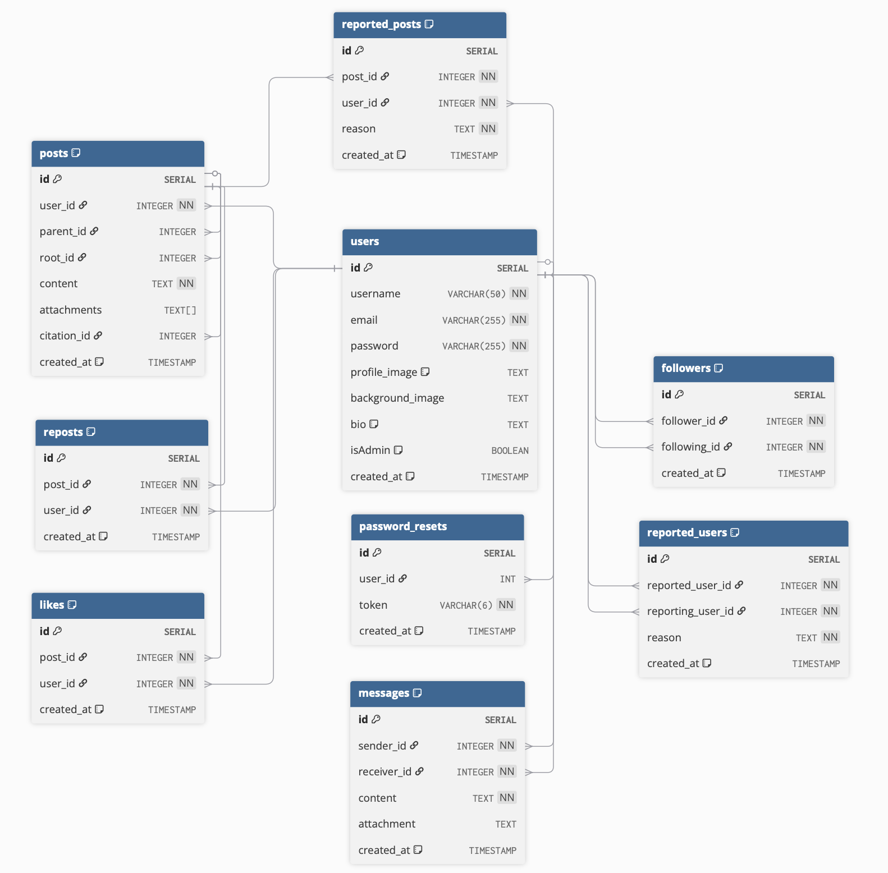

# SMVWA — Social Media Secure Web Application

> **SECURE VERSION**
> This application is a hardened, production-grade version of SMVWA. All previously identified vulnerabilities have been fixed. Suitable for secure development, code review, and as a reference for best practices.


---

## Table of Contents

1. [About](#about)
2. [Tech Stack](#tech-stack)
3. [Architecture](#architecture)
4. [Requirements](#requirements)
5. [Getting Started](#getting-started)
6. [Database Management](#database-management)
7. [Demo Accounts](#demo-accounts)
8. [Tests](#tests)
9. [SAST](#sast)
10. [Project Structure](#project-structure)

---


## About

SMVWA Secure is a hardened social media application (Twitter clone) built with Node.js. This version contains **no known vulnerabilities** and follows secure coding best practices. It is designed for:

- **Developers** — as a reference for secure Node.js/Express/PostgreSQL application architecture
- **Security engineers** — for code review, secure design, and as a baseline for SAST/DAST tools
- **Educators** — to demonstrate secure implementations and compare with the vulnerable version

All vulnerabilities present in the original SMVWA have been remediated in this version.

---


## Tech Stack

### Backend
| Technology | Version | Role |
|---|---|---|
| Node.js | 18 | Runtime |
| Express | 4.x | HTTP framework |
| PostgreSQL | 15 | Database |
| `pg` | 8.x | PostgreSQL client |
| `ws` | 8.x | WebSocket server (real-time chat) |
| `bcrypt` | 6.x | Password hashing |
| `node-serialize` | 0.0.4 | Serialization |
| `multer` | 2.x | Multipart file uploads |
| `cookie-parser` | 1.x | Cookie parsing |
| `dotenv` | 16.x | Environment variables |
| `cors` | 2.x | CORS middleware |

### Frontend
| Technology | Version | Role |
|---|---|---|
| Node.js | 18 | Runtime |
| Express | 4.x | HTTP framework + SSR proxy |
| EJS | 3.x | Server-side HTML templating |
| `axios` | 1.x | HTTP client (frontend → backend proxy) |
| `multer` | 2.x | Multipart forwarding |
| Tailwind CSS | 4.x (CDN) | Styling |

### Infrastructure
| Technology | Role |
|---|---|
| Docker | Container runtime |
| Docker Compose | Multi-container orchestration |
| PostgreSQL 15 Alpine | Database image |

### Testing
| Technology | Role |
|---|---|
| Jest | Test runner |
| Supertest | HTTP integration testing |

---


## Architecture

```
┌─────────────────────────────────────────────────────────┐
│                        Browser                          │
└────────────────────────┬────────────────────────────────┘
                         │ :3000
┌────────────────────────▼────────────────────────────────┐
│              Frontend (Node.js / Express / EJS)         │
│   • SSR page rendering                                  │
│   • Proxy → Backend API                                 │
└────────────────────────┬────────────────────────────────┘
                         │ :3001 (HTTP + WS)
┌────────────────────────▼────────────────────────────────┐
│              Backend (Node.js / Express)                │
│   • REST API                                            │
│   • WebSocket (real-time chat)                          │
└────────────────────────┬────────────────────────────────┘
                         │ :5432
┌────────────────────────▼────────────────────────────────┐
│              PostgreSQL 15                              │
└─────────────────────────────────────────────────────────┘
```

| Service | Container | Port |
|---|---|---|
| Frontend | `smvwa_frontend` | 3000 |
| Backend API + WS | `smvwa_backend` | 3001 |
| PostgreSQL | `smvwa_db` | 5432 |

---



## Requirements

- [Docker](https://docs.docker.com/get-docker/) + [Docker Compose](https://docs.docker.com/compose/)
- Node.js 18+ (only needed to run tests locally)

---


## Getting Started

```bash
# 1. Enter the directory
cd vulnerable/

# 2. Build and start all containers
docker-compose up -d --build

# 3. Initialise the database with demo data
docker-compose exec backend node db/init.js

# 4. Open the application
open http://localhost:3000
```

### Resetting the environment

```bash
# Soft reset — reinitialises tables and seed data (containers keep running)
./reset-db.sh

# Hard reset — wipes the postgres volume, rebuilds containers from scratch, seeds
./reset-db.sh --hard

# Reset without demo data (empty tables)
./reset-db.sh --no-seed
```

### Stopping

```bash
docker-compose down        # stop containers
docker-compose down -v     # stop containers + remove the database volume
```

---


## Database Management

```bash
# Via npm (inside the backend container)
docker-compose exec backend npm run db:init        # drop + schema + seed
docker-compose exec backend npm run db:init:clean  # drop + schema (no seed)

# Or directly
docker-compose exec backend node db/init.js
docker-compose exec backend node db/init.js --no-seed
```

---


## Demo Accounts

Created automatically by `db/init.js`:

| Email | Password | Role |
|---|---|---|
| `admin@smvwa.local` | `Admin1234!` | Admin |
| `alice@smvwa.local` | `Alice1234!` | User |
| `bob@smvwa.local` | `Bob1234!` | User |
| `mallory@smvwa.local` | `Mallory1234!` | User |

---


## Tests

Tests run locally without Docker — the PostgreSQL pool is fully mocked.

```bash
cd backend/

npm test                  # all tests (105 cases)
npm run test:unit         # unit tests only
npm run test:integration  # integration tests only
npm run test:coverage     # + code coverage report
npm run test:watch        # watch mode (TDD)
```

### Coverage

| File | Scope |
|---|---|
| `tests/unit/postValidator.test.js` | Post content and pagination validation |
| `tests/unit/auth.middleware.test.js` | Auth and authorisation middleware |
| `tests/unit/routeHelpers.test.js` | Error handling helper |
| `tests/integration/auth.routes.test.js` | Register, login, password reset |
| `tests/integration/posts.routes.test.js` | Post CRUD, ownership checks |
| `tests/integration/chat.routes.test.js` | File upload, path traversal, messages |

---


## SAST

The project includes a static analysis pipeline that intentionally finds the vulnerabilities placed in the code.

### Tools

| Tool | Purpose |
|---|---|
| **ESLint + eslint-plugin-security** | Detects timing attacks, unsafe regex, object injection, `eval`, non-literal `fs` calls |
| **Semgrep** | Custom rules for SQLi, RCE (node-serialize), SSTI (EJS), path traversal, open redirect |
| **njsscan** | Node.js-specific security patterns from OWASP Mobile Security |

### Run locally

```bash
# ESLint security scan
cd backend/
npm run lint:security          # outputs reports/eslint-security.json

# Semgrep (requires semgrep installed: pip install semgrep)
semgrep scan \
  --config p/owasp-top-ten \
  --config p/nodejs \
  --config .semgrep/custom-rules.yml \
  backend/

# njsscan (requires: pip install njsscan)
njsscan backend/
```

### CI/CD (GitHub Actions)

The workflow at `.github/workflows/sast.yml` runs automatically on push/PR and:
- Uploads SARIF results to **GitHub Security > Code scanning**
- Posts a summary table to the **Actions** job summary
- Archives JSON/SARIF artifacts for 30 days

---


## Project Structure

```
vulnerable/
├── docker-compose.yml
├── reset-db.sh
├── .env.example
│
├── backend/
│   ├── app.js
│   ├── websocket.js
│   ├── config/constants.js
│   ├── db/
│   │   ├── pool.js
│   │   ├── schema.sql
│   │   └── init.js
│   ├── middleware/auth.js
│   ├── routes/
│   │   ├── auth.js
│   │   ├── chat.js
│   │   ├── posts/
│   │   │   ├── crud.js
│   │   │   └── preview.js
│   │   └── users/
│   │       └── profile.js
│   ├── tests/
│   │   ├── unit/
│   │   └── integration/
│   └── uploads/
│
├── frontend/
│   ├── app.js
│   ├── routes/
│   │   ├── api.js
│   │   └── auth.js
│   ├── views/
│   │   ├── chat.ejs
│   │   └── pages/
│   │       └── settings.ejs
│   └── utils/contentParser.js
```
